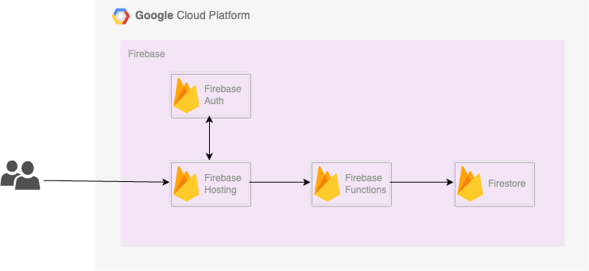

# IdeaSpark



## 実行コマンド
### アプリの起動
```bash
make start-app
```

### functions emulatorの起動
```bash
make start-functions
```

### deploy
```bash
make deploy-hosting
```

```bash
make deploy-functions
```